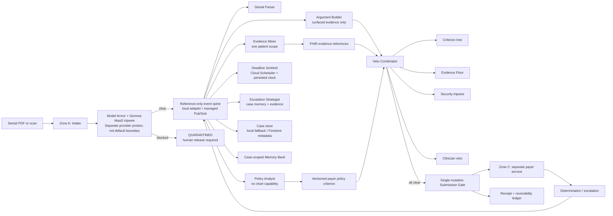

# Appeal architecture

The repository currently executes the local deterministic path and exposes the
same API facade through a synthetic-only Cloud Run deployment with Firestore
case metadata persistence. A synthetic seven-agent ADK/Gemini smoke, a
multimodal ADK case exit, and the hosted Model Armor -> Gemma boundary are
recorded. The same seven-role ADK graph is also deployed to managed Agent
Runtime with Agent Registry and Agent Identity metadata, a managed session,
an initial reference-only Memory Bank write, and verified Memory Bank and
Cloud Trace readback. Managed Runtime egress now passes through a regional
Agent Gateway with IAP authorization in enforced, fail-closed mode; the
observed platform destinations are registered and a routed MCP read/denied-
canary proof is recorded. The external payer and hosted console remain future
integrations.

The local executor runs the role adapters in deterministic graph order and
publishes reference-only event records through `LocalEventSpine`. Its typed
evidence-arrival and payer-determination handlers rehydrate persisted cases,
record processed event IDs, and resume safely after a restart. The hosted
boundary persists and publishes the same reference-only events through managed
Pub/Sub; its subscriber currently validates, records, and acknowledges
deliveries and invokes the managed Agent Runtime for one allowlisted synthetic
checkpoint. Broader subscriber-driven workflow execution remains open.

## Non-negotiable boundaries

- No model grants permission to file. The combinator keeps the strictest
  verdict, and clinician approval is the final veto.
- Intake is the untrusted-document boundary. A blocked instruction moves the
  case to `QUARANTINED` before parsing or submission.
- Evidence Miner is the only chart reader and receives one patient scope.
  Policy Analyst has no chart capability in `config/agent_policies.json`.
- Argument Builder can compose only from policy clauses and surfaced evidence
  references. The Evidence Floor rejects unsupported claims.
- Submission Gate is the only component with external-mutation capability and
  uses an idempotency key. The reversibility journal records its compensating
  action.
- Events carry metadata and references only; clinical content stays in the
  in-process context or future scoped stores.

## Current versus future implementation

| Boundary | Current local implementation | Future managed target |
|---|---|---|
| Agent graph | Deterministic seven-role graph + synthetic ADK smoke + managed Agent Runtime deployment + one controlled synthetic subscriber checkpoint | Broader subscriber-driven ADK execution on Agent Runtime |
| HTTP backend | Synthetic deterministic facade on Cloud Run with Firestore case metadata | Authenticated case API with managed workflow services |
| Case state | Immutable state machine + local fallback or Firestore adapter | Durable workflow sessions and IAM conditions |
| Event delivery | `LocalEventSpine` plus Firestore-registered managed Pub/Sub push and a Firestore-idempotent synthetic Agent Runtime subscriber | Broader managed subscriber workflow |
| Memory | `ScopedMemoryBank` plus managed Memory Bank write and verified retrieval | Verified per-case Memory Bank revisions and broader case workflow |
| Payer | `PayerAdjudicator` with a private criterion copy | Separate Cloud Run service/account |
| Security | Local fallback + hosted Model Armor/Gemma in series + enforced Agent Gateway/IAP policy with observed platform endpoint registration | Broader endpoint/tool policy coverage around the managed path |
| Human action | Local `approve()` resume step | Firebase-authenticated console co-signature |
| External action | Local receipt-only mutation representation | Deterministic payer submission API |
