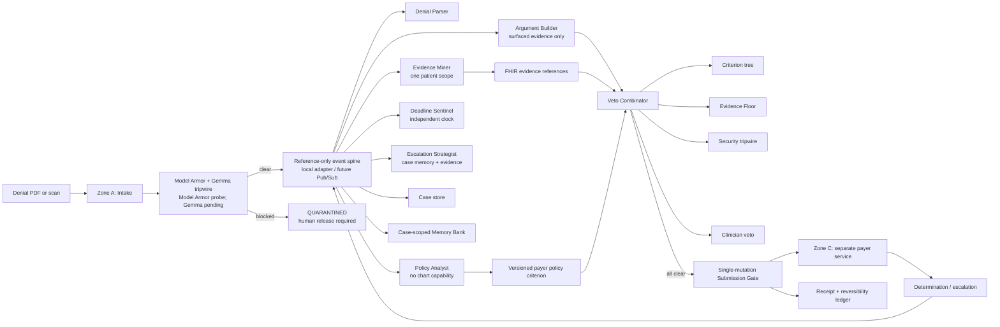

# Appeal architecture

The repository currently executes the local deterministic path. A synthetic
seven-agent ADK/Gemini smoke and a separate managed Model Armor measurement
are recorded as provider probes; managed Google Cloud services, Gemma, and the
external payer remain future adapters and are marked as such below.

The local executor runs the role adapters in deterministic graph order and
publishes reference-only event records through `LocalEventSpine`. Subscriber-
driven execution on Pub/Sub is a managed-service step, not a claim of the
current local implementation.

## Non-negotiable boundaries

- No model grants permission to file. The combinator keeps the strictest
  verdict, and clinician approval is the final veto.
- Intake is the untrusted-document boundary. A blocked instruction moves the
  case to `QUARANTINED` before parsing or submission.
- Evidence Miner is the only chart reader and receives one patient scope.
  Policy Analyst has no chart capability in `config/agent_policies.json`.
- Argument Builder can compose only from policy clauses and surfaced evidence
  references. The Evidence Floor rejects unsupported claims.
- Submission Gate is the only component with external-mutation capability and
  uses an idempotency key. The reversibility journal records its compensating
  action.
- Events carry metadata and references only; clinical content stays in the
  in-process context or future scoped stores.

## Current versus future implementation

| Boundary | Current local implementation | Future managed target |
|---|---|---|
| Agent graph | Deterministic seven-role graph + synthetic ADK smoke | ADK 2.x workflow on Agent Runtime |
| Case state | Immutable state machine + local store | Firestore with IAM conditions |
| Event delivery | `LocalEventSpine` | Pub/Sub topics and idempotent subscribers |
| Memory | `ScopedMemoryBank` | Per-case Memory Bank revisions |
| Payer | `PayerAdjudicator` with a private criterion copy | Separate Cloud Run service/account |
| Security | Local fallback + managed Model Armor probe | Model Armor and Gemma in series at the workflow boundary |
| Human action | Local `approve()` resume step | Firebase-authenticated console co-signature |
| External action | Local receipt-only mutation representation | Deterministic payer submission API |
